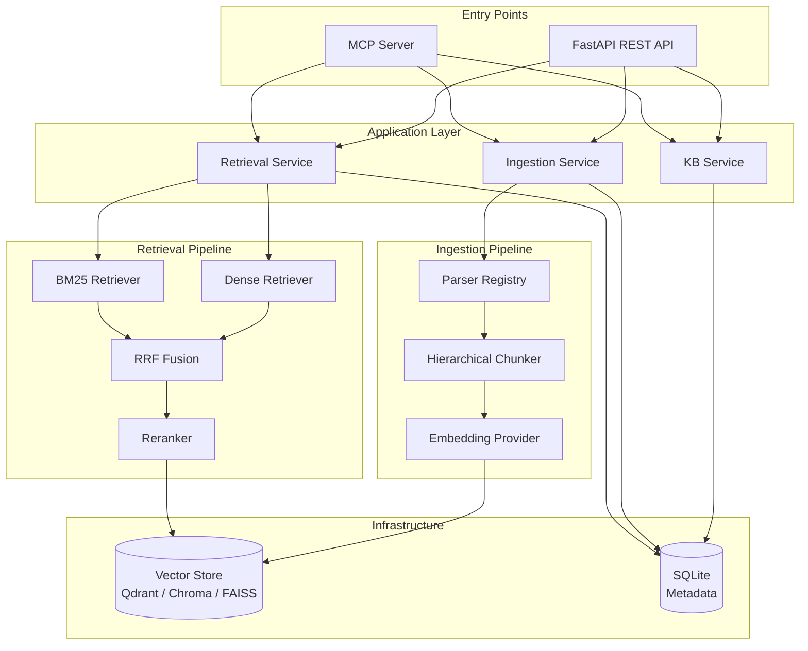
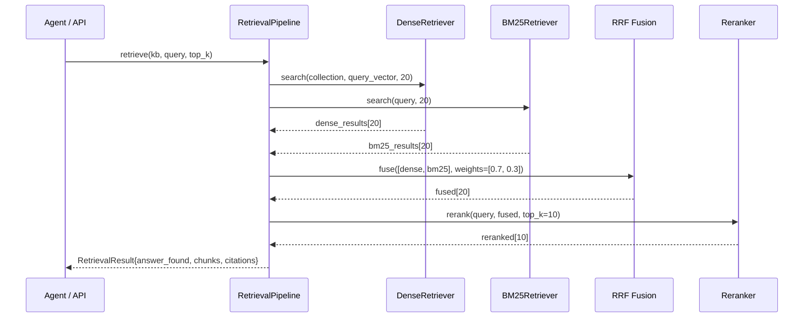

# Knowledge Base Platform

> Production-grade local RAG platform for enterprise document retrieval and AI-assisted knowledge management.

[](https://python.org)
[](https://fastapi.tiangolo.com)
[](https://docker.com)
[](https://modelcontextprotocol.io)

---

## Overview

A **fully local, production-grade RAG platform** that enables:

- **Multiple isolated knowledge bases** (ISO Standards, Research Papers, Company Guidelines, etc.)
- **Intelligent document ingestion** — PDFs with complex tables, figures, and layouts
- **Hybrid retrieval** — Dense + BM25 + Reciprocal Rank Fusion + cross-encoder reranking
- **Grounded answers** — never hallucinates; returns `answer_found: false` when evidence is absent
- **MCP tool server** — callable by GitHub Copilot Agent Mode
- **REST API** — OpenAPI-documented FastAPI server
- **Full observability** — structured logging, Prometheus metrics, OpenTelemetry tracing

---

## Architecture



### Retrieval Flow



---

## Features

| Feature | Description |
|---------|-------------|
| Multi-KB | Create unlimited isolated knowledge bases |
| PDF Parsing | Docling (primary) + PyMuPDF + OCR fallback |
| Table Extraction | Multi-page, nested, merged-cell tables |
| Figure Processing | Extract + caption + VLM description |
| Hierarchical Chunking | Section/subsection/table/figure aware |
| Hybrid Search | Dense ANN + BM25 + RRF fusion |
| Reranking | BGE reranker cross-encoder |
| KB Routing | Semantic routing by KB description |
| Grounding | Zero hallucination — `answer_found: false` |
| MCP | GitHub Copilot Agent Mode compatible |
| Observability | Loguru + Prometheus + OpenTelemetry |
| Docker | Full compose stack with Qdrant |

---

## Quick Start

### Prerequisites

- Python 3.11+
- Docker + Docker Compose
- (Optional) NVIDIA GPU for faster embeddings

### 1. Clone and configure

```bash
git clone https://github.com/your-org/knowledge-base.git
cd knowledge-base
cp .env.example .env
```

### 2. Start with Docker (recommended)

```bash
# Development mode (hot-reload)
docker compose --profile dev up

# Production mode
docker compose --profile production up -d
```

### 3. Or run locally

```bash
python -m venv .venv
source .venv/bin/activate
pip install -e ".[dev]"

# Start Qdrant separately
docker run -p 6333:6333 qdrant/qdrant:v1.12.0

# Start the API
python -m uvicorn src.api.app:app --reload
```

The API is now at **http://localhost:8000** and docs at **http://localhost:8000/docs**.

---

## KB Management

### Create a knowledge base

```bash
curl -X POST http://localhost:8000/knowledge-bases \
  -H "Content-Type: application/json" \
  -d '{
    "name": "ISO Standards",
    "description": "ISO 9001, 27001, 14001 quality and safety management standards."
  }'
```

### Ingest documents

```bash
# Upload a PDF
curl -X POST http://localhost:8000/ingest \
  -F "kb_id=<your-kb-id>" \
  -F "file=@iso_9001.pdf"

# Ingest a folder (server-side path)
curl -X POST http://localhost:8000/ingest/folder \
  -H "Content-Type: application/json" \
  -d '{"kb_id": "<your-kb-id>", "folder_path": "/data/iso_docs/"}'
```

### Retrieve grounded answers

```bash
curl -X POST http://localhost:8000/retrieve \
  -H "Content-Type: application/json" \
  -d '{
    "query": "What are the requirements for ISO 9001 certification?",
    "kb_id": "<your-kb-id>",
    "top_k": 10
  }'
```

Response:

```json
{
  "answer_found": true,
  "query": "What are the requirements for ISO 9001 certification?",
  "chunks": [...],
  "citations": [
    {
      "source_document": "iso_9001_2015.pdf",
      "page_numbers": [12, 13],
      "section": "4.1 Understanding the organization",
      "score": 0.9423,
      "excerpt": "The organization shall determine external and internal issues..."
    }
  ]
}
```

---

## GitHub Copilot / MCP Integration

### VS Code Configuration

Add to your VS Code `settings.json`:

```json
{
  "github.copilot.chat.experimental.mcp": {
    "servers": {
      "knowledge-base": {
        "command": "python",
        "args": ["-m", "src.mcp.server"],
        "cwd": "/path/to/knowledge-base",
        "env": {
          "PYTHONPATH": "/path/to/knowledge-base"
        }
      }
    }
  }
}
```

### Available MCP Tools

| Tool | Description |
|------|-------------|
| `list_knowledge_bases` | List all KBs with descriptions |
| `retrieve_from_kb` | Retrieve grounded results from a specific KB |
| `search_knowledge_bases` | Search all KBs simultaneously |
| `list_documents` | List documents in a KB |
| `create_knowledge_base` | Create a new KB |

### Agent Workflow

```
1. Call list_knowledge_bases() → read descriptions
2. Select the most relevant KB
3. Call retrieve_from_kb(kb_name="...", query="...")
4. If answer_found=True → use chunks with citations
   If answer_found=False → do not fabricate; inform the user
```

---

## Configuration

Configuration is loaded from `config/{APP_ENV}.yaml` and merged with environment variables.

| Environment | File |
|-------------|------|
| development | `config/dev.yaml` |
| test | `config/test.yaml` |
| production | `config/prod.yaml` |

Key settings:

```yaml
embedding:
  provider: sentence_transformers  # or: ollama, openai_compatible
  model: BAAI/bge-m3
  device: cpu                      # or: cuda, mps

vector_store:
  provider: qdrant                 # or: chroma, faiss

reranker:
  enabled: true
  model: BAAI/bge-reranker-v2-m3

chunking:
  chunk_size: 750
  chunk_overlap: 100
```

---

## Supported Document Types

| Type | Status | Parser |
|------|--------|--------|
| PDF | ✅ Production | Docling + PyMuPDF + OCR |
| DOCX | 🔜 Planned | — |
| PPTX | 🔜 Planned | — |
| HTML | 🔜 Planned | — |
| Markdown | 🔜 Planned | — |
| CSV / Excel | 🔜 Planned | — |

---

## Docker Profiles

```bash
# Development (hot-reload API + Qdrant)
docker compose --profile dev up

# Production (API + Qdrant)
docker compose --profile production up -d

# With monitoring (Prometheus + Grafana)
docker compose --profile production --profile monitoring up -d

# With Ollama (local LLM/VLM)
docker compose --profile production --profile ollama up -d
```

---

## Troubleshooting

### Vector store connection failed
Ensure Qdrant is running:
```bash
docker compose up qdrant
curl http://localhost:6333/healthz
```

### Slow embeddings
Enable GPU: set `EMBEDDING_DEVICE=cuda` (requires CUDA).
Or use a smaller model: `EMBEDDING_MODEL=BAAI/bge-small-en-v1.5`.

### PDF parsing errors
Check the parser fallback chain in logs. If Docling fails, PyMuPDF takes over automatically.

### OCR not working
Ensure Tesseract is installed:
```bash
which tesseract        # local
tesseract --version
```

---

## Roadmap

- [ ] DOCX, PPTX, HTML, Markdown ingestion
- [ ] VLM-powered figure description (Qwen2.5-VL)
- [ ] Knowledge graph integration
- [ ] RBAC and API authentication
- [ ] Streaming retrieval responses
- [ ] Async ingestion queue (Celery/ARQ)
- [ ] Web UI for KB management

---

## Documentation

Full documentation: `docs/`

- [Architecture](docs/architecture.md)
- [Developer Guide](docs/developer-guide.md)
- [API Reference](docs/api-reference.md)
- [Deployment Guide](docs/deployment-guide.md)
- [Operations Runbooks](docs/operations/runbooks.md)
- [Roadmap](docs/roadmap.md)
