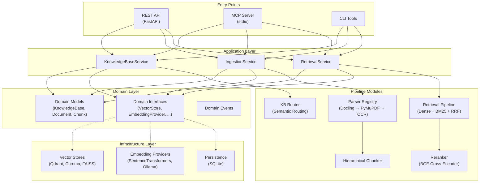
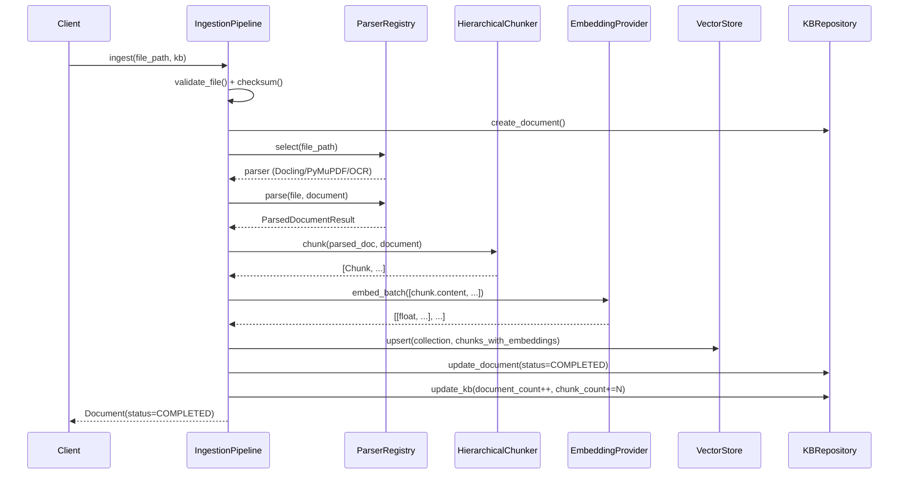
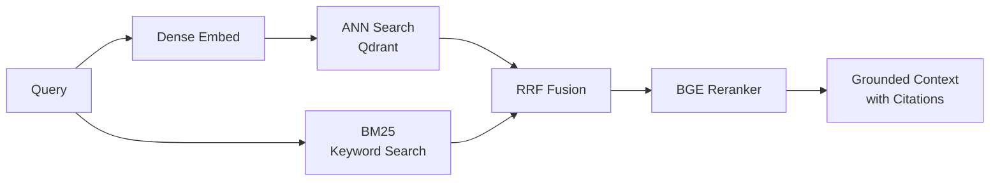

# Architecture

## Overview

The Knowledge Base platform follows **Clean Architecture** principles with strict layer separation and dependency inversion.

## Layer Diagram



## Component Responsibilities

### Domain Layer (`src/domain/`)

Zero external dependencies. Contains:

| Module | Purpose |
|--------|---------|
| `models/knowledge_base.py` | KB entity |
| `models/document.py` | Document entity |
| `models/chunk.py` | Chunk entity + metadata |
| `models/retrieval.py` | RetrievalResult + Citation |
| `interfaces/` | Abstract contracts for all pluggable components |
| `events/` | Domain events for loose coupling |

### Application Layer (`src/application/`)

Depends only on domain interfaces. Contains:

| Module | Purpose |
|--------|---------|
| `services/services.py` | KB CRUD, ingestion, retrieval orchestration |

### Infrastructure Layer (`src/infrastructure/`)

Concrete implementations:

| Module | Purpose |
|--------|---------|
| `persistence/sqlite_kb_repository.py` | SQLite-backed KB/Doc persistence |
| `vector_stores/qdrant_store.py` | Qdrant vector store |
| `vector_stores/chroma_store.py` | ChromaDB vector store |
| `vector_stores/faiss_store.py` | FAISS local vector store |
| `embeddings/sentence_transformers_provider.py` | Local dense embeddings |
| `embeddings/ollama_provider.py` | Ollama embedding API |
| `embeddings/openai_compatible_provider.py` | OpenAI-compatible API |

## Ingestion Pipeline



## Retrieval Pipeline



## Storage Architecture

```
data/
├── knowledge_base.db          # SQLite: KB and Document metadata
├── knowledge_bases/           # Raw source files (optional)
│   └── {kb_id}/
│       └── {doc_id}/
│           └── original.pdf
├── uploads/                   # Temporary upload staging
├── models/                    # Cached embedding/reranker models
│   ├── BAAI_bge-m3/
│   └── BAAI_bge-reranker-v2-m3/
├── faiss_indices/             # FAISS index files (if using FAISS)
│   ├── {collection}.index
│   └── {collection}.meta.pkl
└── logs/
    └── app_2024-01-01.log.gz
```

Qdrant stores vectors externally in its own storage volume.

## Configuration Strategy

```
config/dev.yaml     → development defaults
config/test.yaml    → test overrides (fast, no OCR, no reranker)
config/prod.yaml    → production settings (GPU, full reranker, gRPC)

.env                → secrets and environment-specific overrides
```

Environment variables with `APP_` prefix or nested `__` delimiter override YAML.
